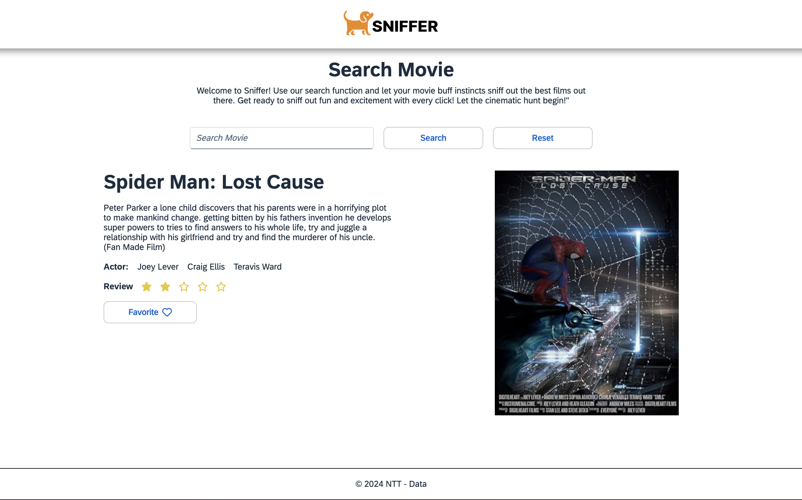

# Full Stack Test Developer

[x] Criar um SPA que busque informações sobre um título de filme pesquisado.

[x] A aplicação front-end deverá se comunicar com a aplicação back-end via api,

[x] O front deverá consumir o objeto recebido e exibir na tela de acordo com o wireframe sugerido.

[x] Aplicação back-end consumirá o serviço OMDBAPI (mais detalhes a seguir), deverá fazer a tratativa dos dados e retornar ao front um DTO.


Para isso você deverá criar uma conta para gerar sua ApiKey no seguinte serviço:
http://www.omdbapi.com/

Junto com este material você deve ter recebido um wireframe para usar como norte do seu layout, porém sinta-se livre para ir além.

## O que será avaliado:
- Capacidade de componentização de conteúdo;
- Organização de código;
- Layout / (UI);
- Usabilidade / (UX);
- Conhecimento na linguagem utilizada;
- Responsividade do conteúdo;

## Requisitos:
- NodeJS + Nest + TypeScript;
- React + Redux
- Usar UI5 Web Components for React
- Usar SCSS;


## Por fim
versione em um repositório público e nos encaminhe o link.

# Farejador - Movie


Instalação das dependencias:
```bash
$ yarn install
```

Construir todas as aplicações:
```bash
$ yarn build
```

Executar todas as aplicações como DEV
```bash
$ yarn dev
```

# Teste de carga
Instale globalmente a biblioteca `artillery``

```bash
$ npm install -g artillery
```

## Movie API
resultado inicial: [artillery cloud](https://app.artillery.io/share/sh_4c930710fa72e74959dda48b5f78420eac1c161eade39f31ef2281ca49583fef)

### Rorando localmente o teste de carga

Execute
```bash
$ yarn movie-api:load:test
```
